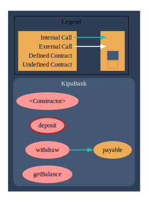

# eth-kipu

<details>
<summary>Module 1</summary>
    
[Intro to Smart Contracts](https://campus.ethkipu.org/course/view.php?id=19)

</details>

<details>
<summary>Module 2</summary>

[Solidity Fundamentals](https://campus.ethkipu.org/course/view.php?id=20)

```
Requisitos de Desenvolvimento
1. Configuração Inicial
    - O contrato deve ter um construtor que receba como parâmetro o limite máximo de ETH que o banco pode armazenar (*bankCap*).
    - Este limite deve ser armazenado em uma variável imutável e usado para validar depósitos futuros.
2. Depósito de Fundos
    - O contrato deve permitir que os usuários façam depósitos de ETH.
    - Antes de aceitar o depósito, deve verificar se o saldo atual do contrato mais o valor depositado excede o limite estabelecido no *bankCap*.
    - Em caso de violação do limite, a transação deve reverter com uma mensagem de erro apropriada.
    - Um evento deve ser emitido ao final de cada depósito bem-sucedido.
3. Saque de Fundos
    - O contrato deve permitir que os usuários realizem saques de valores previamente depositados.
    - Deve haver um limite fixo por saque, definido como uma constante no contrato.
    - O valor solicitado para saque não pode exceder o saldo do usuário nem o limite por saque. Caso isso ocorra, a transação deve reverter com uma mensagem de erro apropriada.
    - Ao final de cada saque bem-sucedido, um evento deve ser emitido.
4. Consulta de Saldo
    - O contrato deve permitir que qualquer pessoa consulte o saldo de ETH armazenado no contrato.
    - Deve ser implementada uma função de visualização para retornar este saldo.
5. Controle e Validação
    - Use modificadores para validar condições que se repetem nas funções.
    - Centralize a lógica de transferências de ETH em uma função interna para evitar duplicação de código.
6. Mensagens de Erro e Eventos
    - Utilize mensagens de erro customizadas para lidar com casos como:
        - Tentativa de depósito que exceda o limite do banco (*bankCap*).
        - Saque de valor maior que o saldo do usuário.
        - Falha na transferência de ETH.
    - Implemente eventos para notificar:
        - Depósitos bem-sucedidos (com endereço do usuário e valor).
        - Saques bem-sucedidos (com endereço do usuário e valor).

Critérios de Implementação Técnica
1. Variáveis
    - Use variáveis immutable para parâmetros do construtor que não mudam.
    - Use constant para valores fixos no contrato.
    - Use mapeamentos para armazenar o saldo de cada usuário.
2. Boas Práticas
    - Nomeie funções, eventos e variáveis de forma descritiva e consistente com os padrões abordados em aula.
    - Adicione comentários explicativos para cada elemento do contrato.
    - Priorize a legibilidade e a organização do código.
3. Segurança
    - Use revert para mensagens de erro, fornecendo informações úteis para o desenvolvedor.

Instruções para Entrega
1. Estrutura do Contrato
    - Crie o contrato em um arquivo .sol.
    - O nome do contrato deve ser KipuBank.
    - Faça o deploy na Sepolia e verifique seu contrato no explorador de blocos.
2. Implementação
    - Certifique-se de implementar todas as funcionalidades descritas nos requisitos.
    - Siga as práticas recomendadas apresentadas em aula.
3. Entrega Final
    - Submeta o endereço do seu contrato verificado no Sepolia Etherscan.
```

Solution:

- [source code](./solidity/KipuBank.sol)
- [sepolia contract/ETherscan](https://sepolia.etherscan.io/address/0x6c003fb34F4c4B8d55572AeB3C79c65c6EC04169#code)
- [sepolia contract/Sourcify](https://repo.sourcify.dev/contracts/full_match/11155111/0x6c003fb34F4c4B8d55572AeB3C79c65c6EC04169/sources/)



</details>

<details>
<summary>Module 3</summary>
    
[Padrões, bibliotecas e padrões](https://campus.ethkipu.org/course/view.php?id=21)

```
Trago duas atividades para vocês, essas atividades serão consideradas como conclusão do módulo 3.

Essas atividades são:
- 1 Contrato ERC20
- 1 Contrato ERC721

Vocês seguirão o padrão OpenZeppelin, mas ambos os contratos precisam possuir:
Funções Públicas Adicionais:
- Função `mint`
- Função `burn`
Controle de Acesso:
- Gargo MINTER - para endereços que possam criar tokens
- Cargo BURNER - para endereços que podem queimar tokens
- Cargo ADMIN - para endereços que podem alterar quem é o MINTER e quem é o BURNER.

OBS: o contrato pode ter multiplos BURNERS e MINTERS. Mas o ADMIN é único.

Prazo de Entrega: 08/03/2025
```

Contrato ERC20:

> [solution](solidity/m3-erc20.sol)
>
> [sepolia contract](solidity/m3-erc20.sol)

Contrato ERC721

> [solution](solidity/m3-erc721.sol) - [verified contract](https://sepolia.etherscan.io/address/0x6dAB69DcF4E9768466f7460CD4d00cFf2E92e7E2#code)
>
> [sepolia contract](solidity/m3-erc20.sol) - [verified contract](https://sepolia.etherscan.io/address/0xeB3ed3E8E53F41666C2f70adADeB7A2cF7145ffC#code)

Foundry version: [...]

</details>

<details>
<summary>Module 4</summary>
    
[Toolkit de desenvolvimento web3](https://campus.ethkipu.org/course/view.php?id=22)

```

```

</details>
